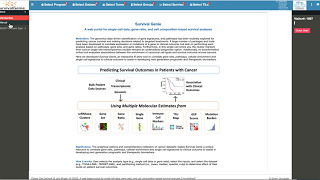

# SurvivalGenie

A web portal for single-cell data, gene-ratio, and cell composition-based survival analyses

## Motivation
The genomics data-driven identification of gene signatures, and pathways has been routinely explored for predicting cancer survival and making decisions related to targeted treatments. A large number of packages and tools have been developed to correlate expression or mutations of a gene to clinical outcome, but lack on performing such analysis based on pathways, gene sets, and gene ratios. Furthermore, in this single-cell omics era, the cluster markers from cancer single-cell transcriptomics studies remains an underutilized prognostic option. Additionally, no bioinformatics online tool evaluates associations between the enrichment of canonical cell types and survival outcome across cancers. 

## Development
Here we developed Survival Genie, an interactive R shiny tool to correlate gene sets, pathways, cellular enrichment and single cell signatures to clinical outcome to assist in developing next generation prognostic and therapeutic biomarkers.  

## Significance
The analytical options and comprehensive collection of cancer datasets makes Survival Genie a unique resource to correlate gene sets, pathways, cellular enrichment and single cell signatures to clinical outcome to assist in developing next generation prognostic and therapeutic biomarkers.

## Availability
Survival Genie is implemented in R Shiny and is available online at https://bbisr.shinyapps.winship.emory.edu/SurvivalGenie/

## Tutorials

A step by step guide on using the tutorial can be found here:

