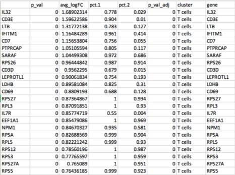

 <h4>
Input Cluster File Format</h4> 

 
 
<h4>
An example single-cell RNA-seq cluster 'txt' file:
</h4>

 
 
<h4>In the input file, there must be a column for,</h4> 

----------------------------

<li>Cluster, labeled as <b>"cluster"</b></li>
<li>Human HGNC gene symbols, labeled as <b>"gene"</b></li>
<li>FDR, column labeled as <b>"p_val_adj"</b></li>
<li>Any other columns are optional</b></li>
<li>The order of the columns does not matter</b></li>
