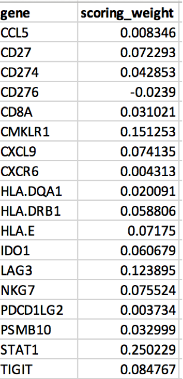

 <h4>
Input Profile Data Format</h4> 

 
 
<h4>
An example data file of 18-gene T-cell-inflammed Gene Expression Profile (GEP) scores:
</h4>

 
 

<h4>In the input file,</h4> 

----------------------------

<li>First column must be Human HGNC gene symbols, labeled as <b>"gene"</b></li>
<li>Second column must be corrosponding gene weightage or score, column label does not matter</li>
